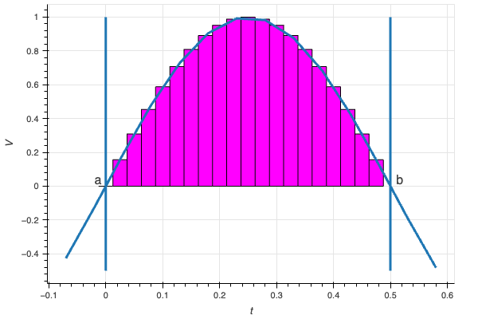

<!--
_class: title
_paginate: false
_header: ''
-->
<!--
TODO: 予約後を追加
-->
筋電図データで学ぶデータ処理入門
# Python編

---
<!--
_class: title
_paginate: false
-->
# 第2回 シーケンス、制御文

---
## 本日のメニュー
- 型の変換　
- print関数
- シーケンス
    - 文字列、リスト、タプル、range、ndarray
- ミュータブル・イミュータブル、イテラブル
- 制御文
    - for, if, while, match
    - 最大値、積分値

---
## エスケープシーケンス

- 文字に機能を持たせる
- `\`（バックスラッシュ）と文字の組み合わせ
    - タブ文字 `\t`
    - 改行 `\n`
- 機能のある文字を文字として扱う
    - `\\` → `\`
    - `\'` → `'`

---
#### `¥`（円記号）と `\`（バックスラッシュ）

##### Windowsの場合
- 同じ文字コード（見た目以外区別がない）
- `\`を入力すべきところは`¥`を入力

#### Macの場合
- 別々の文字コード
- ''\\''を入力する必要があります。日本語キーボードで''\\''を入力するにはOptionキーを押しながら''¥''を入力して下さい。

---
## 1. 型変換 type conversion

- 型キャスト type castingとも
- 暗黙的に行われる場合もある
- 実際は元のオブジェクトから新しいオブジェクトを作成

```python
month = input('今は何月ですか？\t')  # input()の戻り値は文字列
remain = 12 - int(month)
print('今年の残りはあと' + str(remain) + 'ヶ月ですね。')

# 結果
今は何月ですか？3
今年の残りはあと9ヶ月ですね。
```

---
## 2. print関数の行末
```python
print('abc', end='\n')
```
- 「end='行末の文字'」で指定
- デファオルとは'\n'（改行）
- 特殊文字
    - '' 改行無し
    - '\n\n' 改行2つ（1行あける）
    - '\t' タブ文字
#### 位置引数とキーワード引数
- **キーワード引数**`end=...`のように指定
- **位置引数** キーワードを指定しない
    - 位置（順番）によって意味が決まる
- 位置引数が先、後にキーワード引数
    - キーワード引数は順不同

---
## 3. f文字列 f-strings
- 書式を指定した文字列
- 文字列に変数の値を埋め込む
    - {変数}が置き換わる
    - 複数の変数を埋め込むことも出来る
```python
f'文字列{変数}'
f'文字列{変数a}文字列{変数b}'
```

---
## 3. 有効数字
- 左から0ではない桁からの桁数
- どの程度の桁数を信頼出来るか
- 有効数字の次の桁を四捨五入
    - 有効数字4なら5桁目

```python
pi = 3.141592654
print(f'円周率は{pi:#.4g}')

# 結果
3.142
```


---
## シーケンス（型）

順番をもった複数データを扱う型

- 組み込みのシーケンス
    - リスト list
    - タプル tuple
    - レンジ range
    - 文字列
- 外部ライブラリ
    - numpy.ndarray

---
## 文字列の例

'python'
| 順番 | 文字 |
| --- | --- |
| 0 | p |
| 1 | y |
| 2 | t |
| 3 | h |
| 4 | o |
| 5 | n |

順番は0から始まることに注意

---
## 4. 文字列とインデックス

- インデックスを指定して1部を取り出す

```python
name = 'python'
print(name[2])
print(name[-1])

# 出力
t
n
```

負のインデックスは後から

---
## インデックスの位置

- インデックスは文字と文字の間を示す
- 単独の場合インデックスの右の文字
- 範囲の場合インデックスで挟まれた範囲

| |p| |y| |t| |h| |o| |n| |
|---|---|---|---|---|---|---|---|---|---|---|---|---|
|0||1||2||3||4||5||6||
|-6||-5||-4||-3||-2||-1||

---
## 5. スライス

- 範囲を指定して一部を取り出す

```python
name = 'python'
print(name[3:5])
print(name[1:5:2])  # <-追加
print(name[:3])
print(name[3:])
print(name[-2:])

# 出力
ho
yh
pyt
hon
on
```

---
## IndexError

- 大きすぎるインデックスはエラー

```python
name = 'python'
print(name[10])
```
```python
---------------------------------------------------------------------------
IndexError                                Traceback (most recent call last)
<ipython-input-9-b6b2c9db5090> in <cell line: 2>()
      1 name = 'python'
----> 2 print(name[10])

IndexError: string index out of range
```

- スライスはエラーにならない

```python
name = 'python'
print(name[4:10])

# 結果
on
```

---
## 6. リスト（配列） list

- 複数の値をまとめて扱う
- カンマ区切りの値を角カッコで囲ったもの
- 1つ1つのデータを**要素**という
- インデックスで要素を取り出せる
- スライスはリストを**返す**

```python
data = [0, 1, 2, 3, 4]
print(data[3])
print(data[:3])

data[3] = 10
print(data)

# 出力
3
[0, 1, 2]
[0, 1, 2, 10, 4]
```

---
## リスト（配列） list
- 型の異なる値も扱える
    - リストも入れられる（**入れ子**）
- 入れ子の要素
    - 初めの[]で外側のリストの要素（リスト）を選択
    - 続けて[]で内側のリストの要素を選択

```python
num_str = [0, 1, 'python']
data = [[0,1], [2,3]]
print(data[0])
print(data[1][1])

# 出力
[0, 1]
3
```

---
## タプル tuple
- リストとほぼ同じ
- カンマ区切りの値を丸カッコで囲ったもの
    - カッコは省略できる
```python
data = 0, 1, 2, 3, 4
print(data)
data = (5, 6, 7, 8, 9)
print(data)

print(data[3])
print(data[:3])

# 出力
(0, 1, 2, 3, 4)
(5, 6, 7, 8, 9)
8
(5, 6, 7)
```

---
## 6. rangeオブジェクト
- 整数の等差数列を表す
```python
range([start], stop, [step])
```
- startからはじまり、step間隔で、stop未満の数列
- start、stopは省略可
    - 省略した場合はそれぞれ0、1
- stepは負でも良い

---
## 7. シーケンス共通の操作
- インデックスで要素にアクセス
- スライスで要素にアクセス
- `x in s`
    - xがsに含まれていればTrue
- `a + b`
    - `a`の要素に`b`の要素を後ろに連結
- `a * n`
    - aの要素をn回足す
- len(a)
    - aの長さ（要素の数）

---

- 科学技術計算の基本パッケージ
- 主に多次元配列（行列）演算
- 配列同士の演算
- 積分等の計算

---
## 7. The N-dimensional array (numpy.ndarray)

- 配列同士の演算が可能
- 要素へのアクセスはリストと同じ
```python
a = [1, 2, 3]
b = [3, 2, 1]
c = np.array(a)
d = np.array(b)

print('a + b =', a + b)
print('c + d =', c + d)
print('a * 2 =', a * 2)
print('c * 2 =', c * 2)
print('dの2番目の要素:', d[1])

# 出力
a + b = [1, 2, 3, 3, 2, 1]
c + d = [4 4 4]
a * 2 = [1, 2, 3, 1, 2, 3]
c * 2 = [2 4 6]
dの2番目の要素: 2
```

---
## 7., 8. ndarrayの作成と次元
- np.array(リストまたはタプル)
    - 引数の内容と同じndarrayを作成
- np.arange([start], stop, [step])
    - 等差数列を作成
    - startからstep間隔でstop未満まで
    - start、stepは省略した場合、それぞれ0、1
- np.ndarray.shape
    - 配列の次元を返す
- np.ndarray.ndim
    - 配列の次元数を返す
- np.ndarray.reshape(変更後の次元のタプル)
    - 配列の次元を変更

---
## 8. ndarrayの次元

```python
data = np.arange(12)
print(f'dimension number: {data.ndim} \tdimension: {data.shape}')
print(data, end='\n\n')

data = data.reshape((2, 6))
print(f'dimension number: {data.ndim} \tdimension: {data.shape}')
print(data, end='\n\n')

data = data.reshape((3, 2, 2))
print(f'dimension number: {data.ndim} \tdimension: {data.shape}')
print(data)
```

```python
dimension number:  1	dimension:  (12,)
[ 0  1  2  3  4  5  6  7  8  9 10 11]

dimension number:  2	dimension:  (2, 6)
[[ 0  1  2  3  4  5]
 [ 6  7  8  9 10 11]]

dimension number:  3	dimension:  (3, 2, 2)
[[[ 0  1]
  [ 2  3]]

 [[ 4  5]
  [ 6  7]]

 [[ 8  9]
  [10 11]]]
```

--- 
## ndarrayの連結
- numpy.vstack(ndarrayのタプル) 縦に重ねる
- numpy.hstack(ndarrayのタプル) 横に繋げる
```python
a = np.arange(3)
b = np.arange(3, 6)
print(f'変数a: {a}')
print(f'変数b: {b}', end='\n\n')

v = np.vstack((a, b))
h = np.hstack((a, b))
print(f'vstack:\n{v}\n')
print(f'hstack:\n{h}')
```
```python
変数a: [0 1 2]
変数b: [3 4 5]

vstack:
[[0 1 2]
 [3 4 5]]

hstack:
[0 1 2 3 4 5]
```

---
## ndarrayの転置
- 転置：行と列を入れ替える
```python
data = np.arange(6).reshape((2, 3))
print(f'元のデータ:\n{data}\n')

data_t = data.T
print(f'転置したデータ:\n{data_t}')
```
```python
元のデータ:
[[0 1 2]
 [3 4 5]]

転置したデータ:
[[0 3]
 [1 4]
 [2 5]]
 ```

---
## 9. ミュータブル、イミュータブル
- ミュータブル mutable （変更可）
    - list
    - numpy.ndarray
- イミュータブル immutable （変更不可）
    - tuple
    - range
    - str, int, float, etc.

---
## 9. 要素の変更

- ミュータブル
    - リストの場合
```python
numbers = [1, 2, 3, 4, 5]
numbers[2] = 30
print(numbers)

# 結果
[1, 2, 30, 4, 5]
```

- イミュータブル（エラーになる）
    - 文字列の場合
```python
name = 'python'
name[3] = H
print(name)

# 結果
Traceback (most recent call last):
  File "<stdin>", line 1, in <module>
TypeError: 'str' object does not support item assignment
```

---
## イテラブル iterable
- 反復可
    - 要素を順番に取り出せる
- シーケンスはイテラブル
- 辞書型 dict

---
# 制御文

- for
- while
- if
- match (V3.10以降)
<!-- 説明はfor, ifのみ -->

---
## 10. for文 繰り返し
1. `in`の後のイテラブルから値を１つ取り出して
`in`の前の変数に入れる
1. インデントがついた命令を実行する
1. for文まで戻り、`in`の後のリスト等の次の値を
`in`の前の変数に入れ、繰り返す
1. `in`の後のリスト等の値を全て取り出したら終了
- `:`のある行とそれに続くインデントの行を
    あわせて**節 block**
    - for文以外でも節は`:`とインデントの組

```python
num = 0
for i in range(0, 11):
    # 文は複数でも良い
    # その場合は、コメントも含めて同じインデントで。
    num += i
    print(num)
```

---
## 11. for文 繰り返し
- enumerate()でインデックスと併せて取り出せる

```python
# リストの場合
numbers = [10, 11, 12]
for num in numbers:
    print(num)

# インデックスと要素の組
for i, num in enumerate(numbers):
    print(i, num)
```

---
## 12. if 比較
- ifの後の条件が
    - 真なら
        - インデントの付いた命令を実行、終了
    - 偽なら
        - 次のelifの条件を判定し、
        以下同様
    - elif節はいくつあっても良い
    - 全て偽なら
        - else:に続くインデントが
        付いた命令を実行
- elif、elseは無くても良い



```python
num = 3
if num > 3:
    print('3より大きい')
elif num == 3:
    print('3と等しい')
else:
    print('3より小さい')
```

---
## 代表的な比較演算子、論理演算子
| 演算子 | 意味 |
|---|---|
| `a == b` | aがbと等しい |
| `a != b` | aがbと異なる |
| `a < b` | aがbより小さい |
| `a > b` | aがbより大きい |
| `a <= b` | aがｂ以下 |
| `a >= b` | aがb以上 |
| `and` | かつ |
| `or` | もしくは |

---
## よくあるエラー
```python
num = 0
for i in range(10)
    num += i
```

```python
  File "<ipython-input-8-1aeaee0090f8>", line 2
    for i in range(10)
                      ^
SyntaxError: expected ':'
```

- `SyntaxError`
    - 構文の間違い
- `expected ':'`
    - `':'`が期待される
- 必要な`':'`を忘れた

---
## 13. 平均値
- 時間平均の式

$$ \overline{e} = \frac{1}{t_2-t_1}\int_{t_1}^{t_2}e(t)dt $$

- デジタルデータの場合の式
    - 算術平均と同じ
    - 全ての値を合計して、データ数で割る

$$ \overline{e} = \frac{1}{N}\sum^{N}_{n=1}e_{n} $$

---
## 13. 平均値
- for文の場合
    1. for文で全ての値を足す
    1. データの数で割る

```python
mean_value = 0
for value in emg:
    mean_value += value
mean_value /= len(emg)
print(f'平均値(for): {mean_value}')
```

---
## 13. 平均値
- numpy.ndarray.mean()の場合
    - ndarrayの変数に「.mean()」をつけると
    平均が求められる
```python
mean_value = emg.mean()
print(f'平均値(numpy): {mean_value}')
```

---
## 14. 積分値
- 時間積分の式
    - 横軸に時刻、縦軸に筋電位のグラフの
    ある時間範囲の面積
$$ A = \int_{t_1}^{t_2}e(t)dt $$

---
### 14. 矩形近似

- １つのデータにサンプリング周期を掛けた面積（矩形の面積）の合計
$$ A = \frac{1}{f_s}\sum^{N}_{n=1}e_n $$
- ndarrayの変数に「.sum()」をつけると合計が求められる
```python
integral_rect = emg.sum() / FS
print(f'矩形近似: {integral_rect}')
```

---
## SciPy

- 科学計算のための基本的な
アルゴリズム

---
### 14. 台形近似
- 2つのデータとサンプリング周期で
出来る台形の面積の合計
$$ A = \frac{1}{2f_s}\sum^{N-1}_{n=1}(e_n + e_{n+1}) $$
- scipyからintegrate（積分ライブラリ）をインポート
- integrate.trapezoid(データ、dx=サンプリング周期)で
台形近似の積分値が求められる
```python
from scipy import integrate
integral_trapezoid = integrate.trapezoid(emg, dx=1/FS)
print(f'台形近似: {integral_trapezoid}')
```

---
## 15. 最大値
- データの中で最も大きい値
- for文の場合
    - データを一つづつ順番に（for文）
    比較して大きい値を保存しておく（if文）
```python
max_value = 0
for value in emg:
    if value > max_value:
        max_value = value
print(f'最大値(for文): {max_value}')
```

---
## 15. 最大値
- numpy.ndarray.max()の場合
    - ndarrayの変数に「.max()」をつけると
    最大値が求められる
```python
max_value = emg.max()
print(f'最大値: {max_value}')
```

---
## UIの記述
- Colabのコードセルには幾つかのUIの命令
    - #@から始まる
        Pythonにとってはコメント
    - #@title セルのタイトル
    - variable = value #@param {type:"型"}
        - 変数へ値を代入する式に続けて記述
        - 型は文字列はstring、数値はnumber
    - #@markdown テキスト
    - etc.


---
<!--
_backgroundColor: white
paginate: false
header: ''
footer: ''
-->
[](https://numpy.org/)
### The fundamental package<br>for scientific computing with Python
#### https://numpy.org/

---
<!--
_backgroundColor: white
paginate: false
header: ''
footer: ''
-->
[](https://scipy.org/)
# SciPy
### Fundamental algorithms<br>for scientific computing in Python
#### https://scipy.org/
