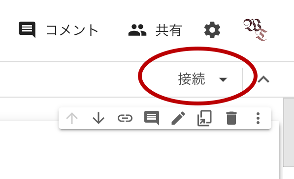
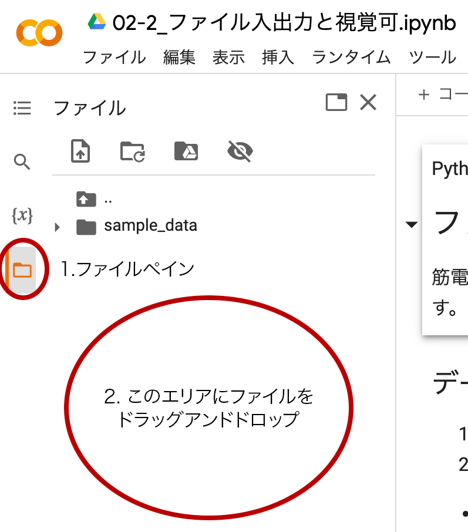

<!--
_class: title
_paginate: false
_header: ''
-->
<!--
TODO: 予約後を追加
-->
筋電図データで学ぶデータ処理入門
# Python編

---
<!--
_class: title
_paginate: false
-->
# 第2回 波形処理

---
## 本日のメニュー
- ユーザー関数
- 標準偏差による切り出し
- 振幅正規化
- 時間正規化

---
## ファイルのアップロード
- 右上の「接続」をクリックしてバックエンドに接続
- RAM、ディスクと表示されるまで待機


---
## ファイルのアップロード
1. ファイルペインを開く
1. ファイルをドラッグアンドドロップ


---
## csvファイルの読み書き
```python
# 読み込み
ndarray = np.loadtxt(file_name,
                 delimiter=',',
                 skiprows=13,
                 usecols=1,
                 encoding='shift_jis'
                )
# 書き込み
np.savetxt(save_file_name,
           ndarray,
           delimiter=',',
           header=header,
           comments='',
           encoding='shift_jis',
           )
```
- ndarray: 読み込んだデータ、書き込むデータのndarray
- file_name: 読み込むファイル名
- delimiter: 区切り文字。csvは','、tsvは'\t'
- skiprows: ファイル先頭から読み込まない行数（整数）
- usecols: 読み込む列数。最初の列は0
- header: 列見出し（文字列）
- comments: コメント文字（デフォルト'# ', 不要なら''）
- encoding: 読み込むファイルの文字コード

---
## 文字コード
- 文字をコンピュータが識別するための番号体系
    - 英文字 ASCIIコード
    - 日本語 Shift JIS, etc.
    - 世界共通 UNICODE

---
## UNICODE
- 種類がある
- UTF-8が実質標準
    - BOM付きとBOMなしの2種類
    BOM: Byte Order Mark
        - CPUの違いによる

- MS ExcelはBOMなしが扱えない
    - いまだにShift JISが無難
    - 実は改行コードも...←解決した？

---

- インタラクティブなグラフ
    - ズームツール etc.
    - 画像としてダウンロード
    - tooltipsで値を確認
    - イベントハンドリング

---
### bokehによる視覚可
```python
from bokeh.io import output_notebook, show
from bokeh.plotting import figure

output_notebook() # グラフの表示をNotebook上（画面）にする
fig = figure() # グラフ描画モデルを作成
fig.line(x, y) # 横軸x, 縦軸yの折れ線グラフ
show(fig) # グラフを表示
```
機能が多すぎるので演習ファイル、公式Webを参照

---
<!--
_backgroundColor: white
-->
[](https://bokeh.org/)
### Interactive Data Visualization<br>in the browser, from Python
#### https://bokeh.org/

