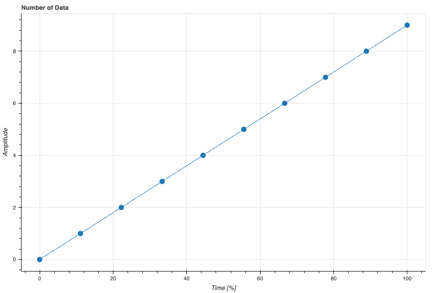

<!--
_class: title
_paginate: false
_header: ''
-->
<!--
TODO: 予約後を追加
-->
筋電図データで学ぶデータ処理入門
# Python編

---
<!--
_class: title
_paginate: false
-->
# 第3回 ファイル入出力、<br>信号処理、視覚化

---
## 本日のメニュー
- 標準偏差による切り出し？
- ファイル入出力
- 視覚化
- 整流処理
- 振幅正規化
- 時間正規化

---
## 文字コード
- 文字をコンピュータが識別するための番号体系
    - 英文字 ASCIIコード
    - 日本語 Shift JIS, etc.
    - 世界共通 UNICODE

---
## UNICODE
- 種類がある
- UTF-8が実質標準
    - BOM付きとBOMなしの2種類<br>BOM: Byte Order Mark
        - CPUの違いによる
        - Windows以外ではBOMなしが標準

- MS ExcelはBOMなしが扱えない
    - いまだにShift JISが無難
    - 実は改行コードも...←解決した？

---
## 1. ファイルのアップロード
- 右上の「接続」をクリックしてバックエンドに接続
- RAM、ディスクと表示されるまで待機


---
## 1. ファイルのアップロード
1. ファイルペインを開く
1. ファイルをドラッグアンドドロップ


---
## 2. csvファイルの読み書き
```python
# 読み込み
ndarray = np.loadtxt(file_name,
                 delimiter=',',
                 skiprows=13,
                 usecols=1,
                 encoding='shift_jis'
                )
# 書き込み
np.savetxt(save_file_name,
           ndarray,
           delimiter=',',
           header=header,
           comments='',
           encoding='shift_jis',
           )
```
- ndarray: 読み込んだデータ、書き込むデータのndarray
- file_name: 読み込むファイル名
- delimiter: 区切り文字。csvは','、tsvは'\t'
- skiprows: ファイル先頭から読み込まない行数（整数）
- usecols: 読み込む列数。最初の列は0
- header: 列見出し（文字列）
- comments: コメント文字（デフォルト'# ', 不要なら''）
- encoding: 読み込むファイルの文字コード

---

- インタラクティブなグラフ
    - ズームツール etc.
    - 画像としてダウンロード
    - tooltipsで値を確認
    - イベントハンドリング

---
## 3. bokehによる視覚化
```python
from bokeh.io import output_notebook, show
from bokeh.plotting import figure

output_notebook() # グラフの表示をNotebook上（画面）にする
fig = figure() # グラフ描画モデルを作成
fig.line(x, y) # 横軸x, 縦軸yの折れ線グラフ
show(fig) # グラフを表示
```
機能が多すぎるので演習ファイル、公式Webを参照

---
## 整流処理
---
## 4. 全波整流
- 全ての値を正にする方法（絶対値）
$$ |e(t)| = \sqrt{\{e(t)\}^2} $$
$$ |E| = \sqrt{{e_n}^2} $$

- [numpy.absolute](https://numpy.org/doc/stable/reference/generated/numpy.absolute.html)(data)
- numpy.abs(data) 省略形

---
## 二乗平均平方根 RMS: Root Mean Square
- 整流平滑化
- （実効値）
1. 二乗して符号をなくす
1. 移動平均をとって平滑化
    - 50〜100（サンプリング周波数の$\frac{1}{20}$〜$\frac{1}{10}$）程度（区間数）のデータを平均（経験的な値）
1. 平方根で次元を戻す
$$ RMS[e(t)] = \sqrt{\frac{1}{T}\int_{-\frac{T}{2}}^{\frac{T}{2}}\{e(t + \tau)\}^2d\tau} $$
$$ RMS[E] = \sqrt{\frac{1}{K}\sum_{k=n-\frac{K}{2}}^{n+\frac{K}{2}}{e_k}^2} $$

---
## 5. RMS
- 二乗 [numpy.square](https://numpy.org/doc/stable/reference/generated/numpy.square.html)(data)
- 平方根 [numpy.sqrt](https://numpy.org/doc/stable/reference/generated/numpy.sqrt.html)(data)

```python
import numpy as np

data = np.arange(5)
print(data)
sq = np.square(data)
print(sq)
sqrt = np.sqrt(sq)
print(sqrt)

# 出力
[0 1 2 3 4]
[ 0  1  4  9 16]
[0. 1. 2. 3. 4.]
```

---
#### 電圧の二乗（おまけ）
- 電力(Power)
    - 単位時間あたりの仕事量（仕事率）
    - 単位: W （ワット）

$$ \begin{split}
電力 = 電圧^2 \times 抵抗 \\
\because 抵抗は一定
\end{split} $$

- 抵抗が一定ならば
    電圧の二乗は電力と相似

---
#### 移動平均 区間数3の例
- 初めの３つのデータの平均


---
#### 移動平均 区間数3の例
- 次の３つのデータの平均


---
#### 移動平均 区間数3の例
- 全てのデータを3つづつ平均
- 始めと終わりのデータが欠ける


---
#### 移動平均 区間数4の例

- 区間数が偶数
    - 移動平均の時刻がずれる
- 区間数は奇数を採用すべき

---
#### 平均の計算
$$ \begin{split}
Ave.    &= \frac{a + b + c}{3} \\
        &= (a + b + c) \times \frac{1}{3} \\
        &= a \times \frac{1}{3} + b \times \frac{1}{3} + c \times \frac{1}{3}
\end{split} $$

---
#### 6. 畳み込み
numpy.convolve(a, v, mode)


---
### 7. RMS
```python
N = 51 # 区間数
if N % 2 == 0: # 偶数の場合は1を足す
    N += 1
v = np.ones(N) / N
rms = np.sqrt(np.convolve(np.square(emg), v, mode='same'))
```
- 要素が全て1のndarray `numpy.ones(shape)`
- 二乗 `numpy.square(data)`
- 畳み込み `numpy.convolve(a, v, mode='same')`
- 平方根 `numpy.sqrt(data)`

注）RMSはデータの始めと終わりに使えない部分が<br>できるので、解析範囲を切り出す前にかけること

---
## 8. 振幅正規化

何らかの基準となるデータを1または100%とした表現

- 筋電図
    - 最大随意収縮データの最大値（%MVC）
- 床反力
    - 被検者の体重
- 関節モーメント
    - 被検者の身長・体重のどちらかまたは両方

---
### 8. 最大随意収縮による正規化

- 最大随意収縮データの最大値を求める（MVC）
- 動作データをMVCで割り、100を掛ける

```python
mvc_value = mvc.max()
percent_mvc = emg / mvc_value * 100
```

---
## 9. 時間正規化
- 任意の時間で正規化
    - 動作の開始から終了まで
    - 1周期
```python
# t: 時刻データ, # t1: 開始時刻, t2:終了
percent_time = t / (t2 - t1) * 100
```

- 任意のデータ数に変換
```python
number_of_samples = 501
resampled = scipy.signal.resample(data, number_of_samples)
percent_time = np.arange(number_of_samples) / (number_of_samples - 1) * 100
```
---
###  時間正規化後の時刻
- 一般的には0〜100%


- データ数 10
- 時刻 0, 11, 22, 33, 44, 56, 67, 78, 89, 100

---
###  時間正規化後の時刻
- 切りのいい数 + 1 がシンプル


- データ数 11
- 時刻 0, 10, 20, 30, 40, 50, 60, 70, 80, 90, 100

--- 
## 10. ndarrayの連結
- numpy.vstack(ndarrayのタプル) 縦に重ねる
- numpy.hstack(ndarrayのタプル) 横に繋げる
```python
a = np.arange(3)
b = np.arange(3, 6)
print(f'変数a: {a}')
print(f'変数b: {b}', end='\n\n')

v = np.vstack((a, b))
h = np.hstack((a, b))
print(f'vstack:\n{v}\n')
print(f'hstack:\n{h}')
```
```python
変数a: [0 1 2]
変数b: [3 4 5]

vstack:
[[0 1 2]
 [3 4 5]]

hstack:
[0 1 2 3 4 5]
```

---
##10. ndarrayの転置
- 転置：行と列を入れ替える
```python
data = np.arange(6).reshape((2, 3))
print(f'元のデータ:\n{data}\n')

data_t = data.T
print(f'転置したデータ:\n{data_t}')
```
```python
元のデータ:
[[0 1 2]
 [3 4 5]]

転置したデータ:
[[0 3]
 [1 4]
 [2 5]]
 ```

---
<!--
_backgroundColor: white
-->
[](https://bokeh.org/)
### Interactive Data Visualization<br>in the browser, from Python
#### https://bokeh.org/

