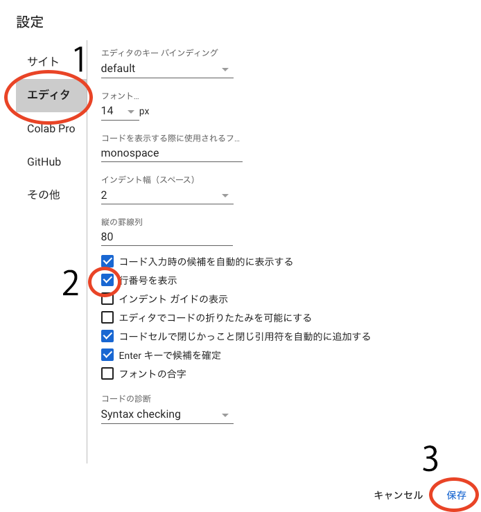

<!--
_class: title
_paginate: false
-->
# 第4回 一括処理

---
## 複数のデータを一括処理する プログラムを作成しましょう +α

---
## +αについて
- 標準偏差による解析範囲の判定
- その他、知っておいた方が良いPythonの知識

---
## 仕様
- 入力データファイル（csv）
    - 処理範囲のみのデータ
    - 1列目にサンプル番号または時刻
    - 2列目に筋電位データ
    - 1行目は列ヘッダー
- 複数の動作ファイルを一括処理
    - MVCファイルと動作ファイルを区別

---
## 仕様
- 波形処理
    - 整流処理
        - 整流処理は全波整流かRMSか選択
    - 振幅正規化（%MVC）
    - 時間正規化
    - 波形処理の要・不要をそれぞれ選択
    - 波形処理結果をグラフ表示
- 平均値、積分値、最大値を算出（代表値）
    - %MVCと生データのどちらで計算するか選択
- 計算に必要なパラメータを設定可能
- 代表値と波形処理したデータを一括でファイル保存

---
## ヒント
- どういう処理をするか入力させる
    - 入力は極力自由度を下げる
- 実際にデータを処理する部分とそれ以外を分ける
    - プログラムの見通しが良くなるように
- 条件（if文）によって処理内容を決める
- ファイルの一覧を取得してfor文で繰り返す

- 一時的な変数も活用

---
## サポートについて
- この一括処理プログラムのサポートは
    原則Discordで行います
    - 他の方との情報共有のため
- 必要に応じて作成中のファイルを共有してください
    - 行番号で場所を参照する場合あり
    - 方法は次のページ

---
## Notebookの共有
- 右上の「共有」をクリック

- メールアドレスを入力し「完了」をクリック

---
## 行番号の表示
- 右上の歯車アイコンをクリック

- エディタタブ（１）の「行番号を表示」（２）を
    チェックして保存（３）

